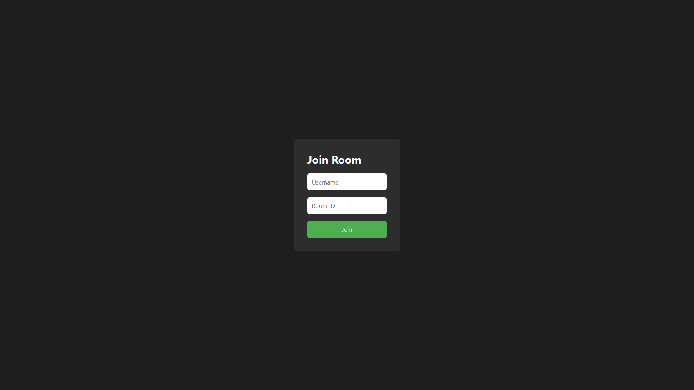
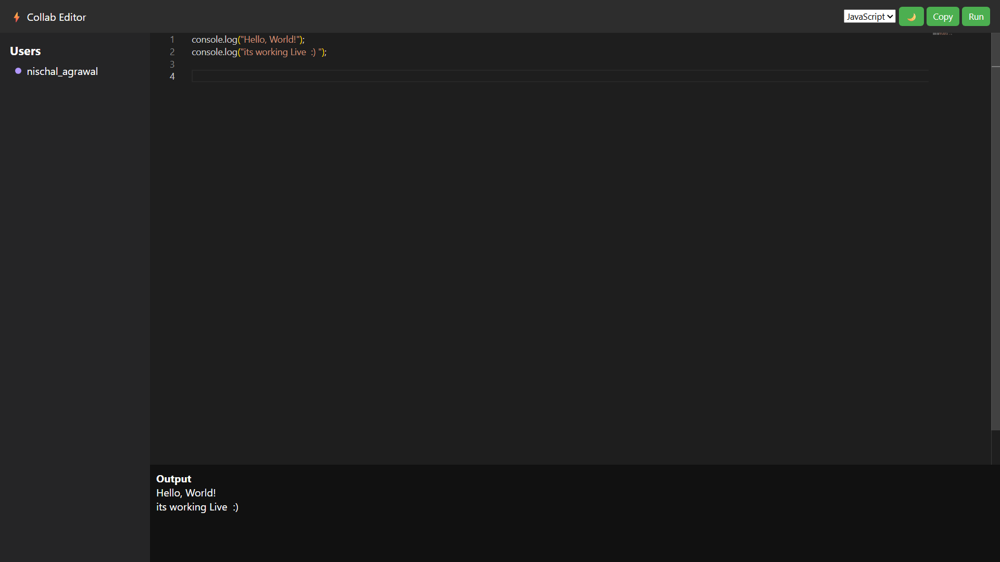
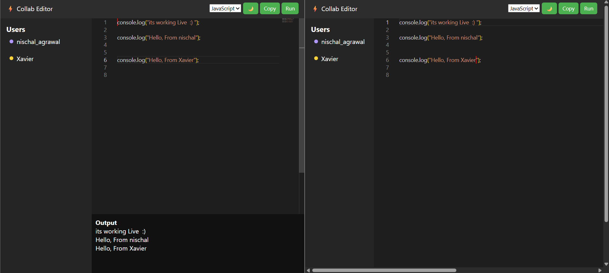
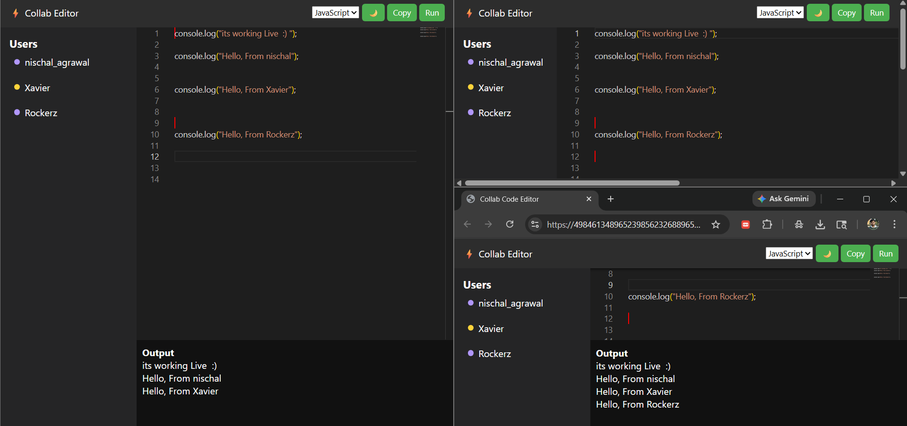
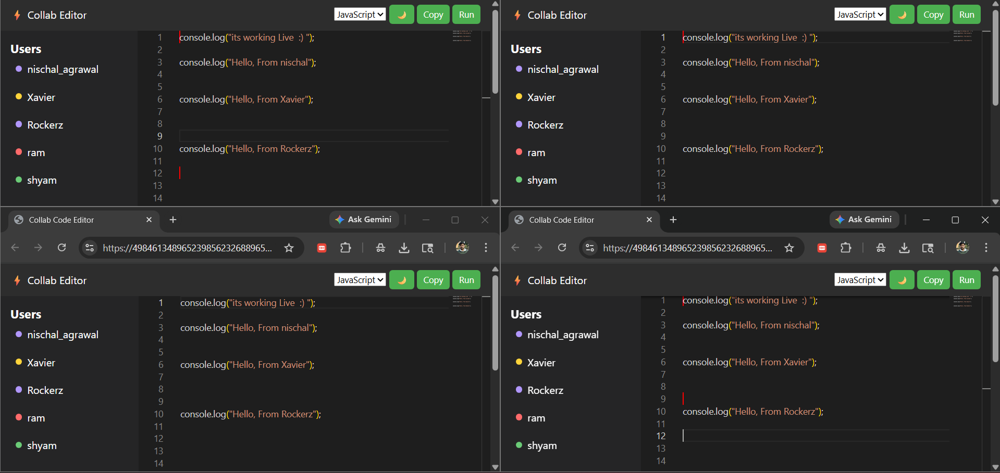

# Collaborative Code Editor (Real-Time)



A real-time collaborative code editor that enables multiple users to join a shared room and edit code simultaneously with live synchronization, cursor tracking, and a seamless editing experience.

---

## Live Demo

- Frontend: https://4984613489652398562326889653265498465.netlify.app/  
- Backend: https://collab-code-editor-6k61.onrender.com  

---

## Features



- Real-time multi-user code editing  
- Room-based collaboration system  
- Live cursor tracking  
- Monaco Editor integration (VS Code-like experience)  
- Active users list  
- JavaScript code execution (client-side)  
- Backend monitoring APIs (`/health`, `/status`, `/users`)  
- Full deployment (Netlify + Render)

---

## How It Works



1. User joins a room with a username  
2. Frontend establishes a WebSocket connection  
3. Code changes are emitted to the server  
4. Server broadcasts updates to other users in the room  
5. All clients update their editor state in real-time  

User → Socket Event → Server → Broadcast → Other Users

---

## Cursor Tracking



- Tracks cursor position in real-time  
- Broadcasts position via WebSocket  
- Displays other users' cursors using Monaco decorations  

---

## Active Users



- Displays users currently in the room  
- Updates dynamically when users join/leave  

---

## Tech Stack

**Frontend**
- HTML, CSS, JavaScript  
- Monaco Editor  
- Socket.io Client  

**Backend**
- Node.js  
- Express.js  
- Socket.io  

**Deployment**
- Frontend: Netlify  
- Backend: Render  

---

## Project Structure
```
collab-code-editor/
│
├── client/
│   ├── public/
│   │   ├── index.html
│   │   ├── js/
│   │   │   ├── main.js
│   │   │   ├── socket.js
│   │   │   ├── editor.js
│   │   │   └── ui.js
│   │   ├── css/
│   │   │   └── styles.css
│
├── server/
│   ├── models/
│   │   └── roomModel.js
│   ├── services/
│   │   └── roomService.js
│   ├── socket/
│   │   └── socketHandler.js
│   ├── server.js
│
└── README.md
```
---

## Backend API Endpoints

| Endpoint | Description |
|--------|------------|
| / | Server status |
| /health | Health check |
| /status | System information |
| /users | Active users count |

---

## Local Setup

### Clone Repository
git clone <your-repo-url>
cd collab-code-editor

### Run Backend
cd server
npm install
npm start

### Run Frontend
cd client
npx http-server public

Open: http://localhost:3000

---

## Challenges Faced

- Cross-origin WebSocket connection issues  
- CORS configuration for Socket.io  
- Static asset loading during deployment  
- API limitations for code execution  
- Hosting constraints  

---

## Future Improvements

- Authentication (JWT)  
- Database integration (MongoDB / Redis)  
- Multi-language execution  
- Room sharing via URL  
- UI/UX improvements  

---

## Author

Nischal Agrawal
